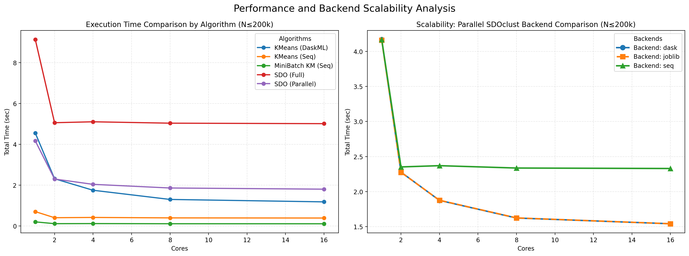
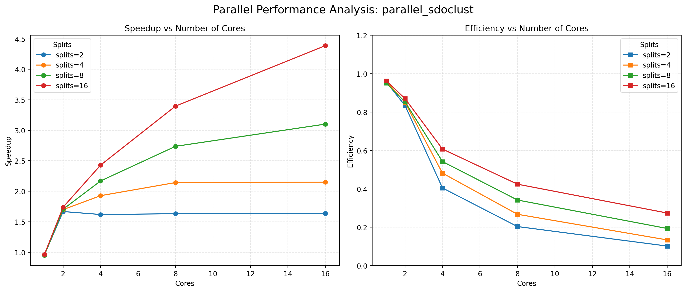
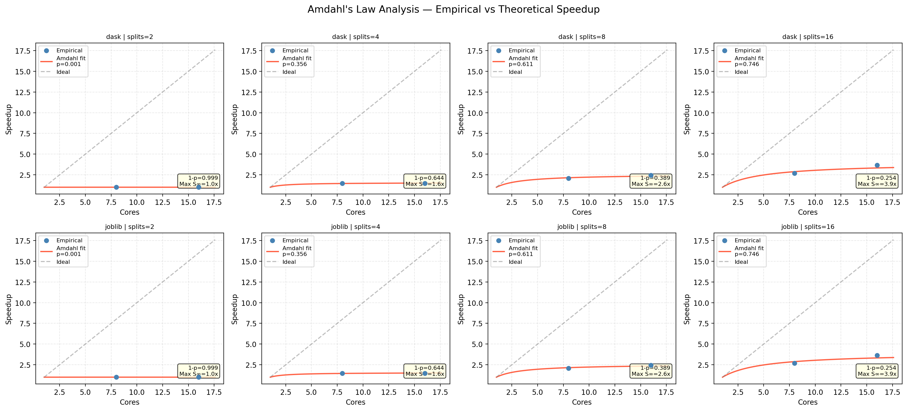
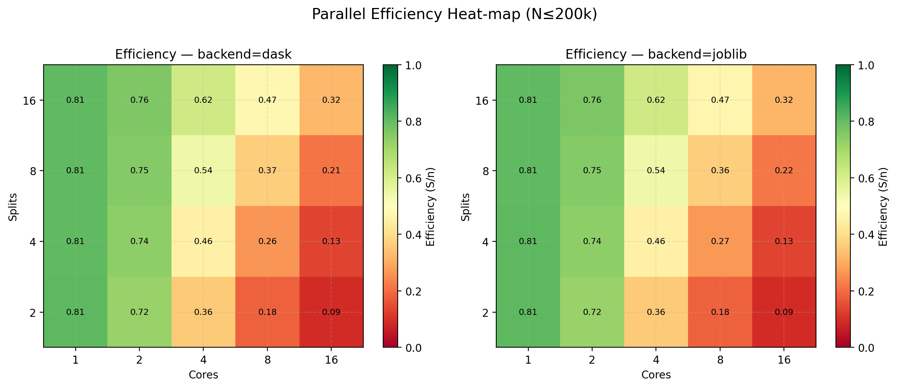
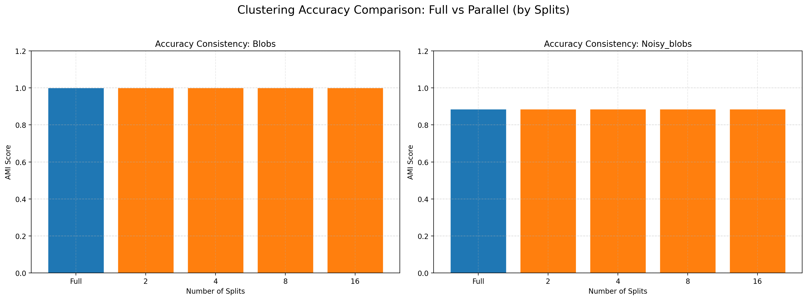
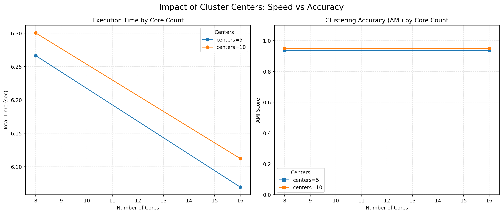
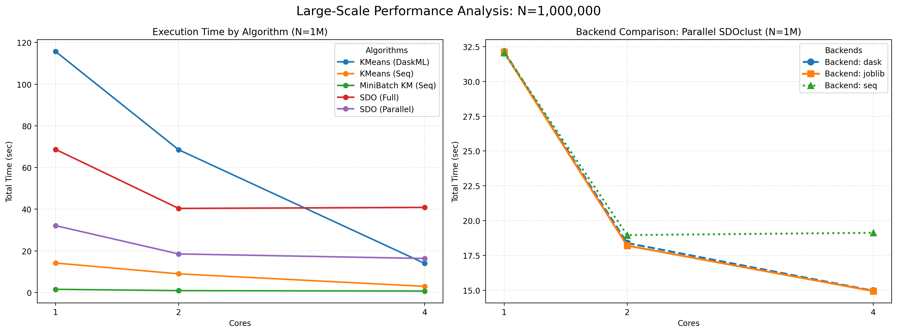
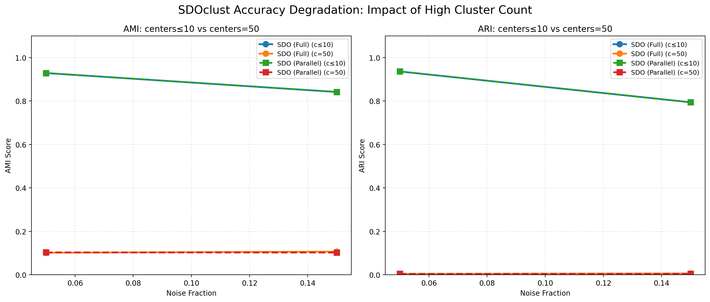

# Parallelization of SDOclust

## Overview
This project aims to develop a split based parallel wrapper pipeline around SDOclust and evaluate its performance against baselines.

## Methodology
1. Data Splitting  
The dataset is divided into multiple splits of similar size.
  
2. Observer Model (Split-A)   
- SDOclust is run only on one split (split-A).  
- From the fitted model, observers and observer cluster labels are extracted.  
- These observers are then shared with all other splits.  
- Label extension is performed independently on each remaining split.  
- Predicted labels are merged back to recover the full clustering.

3. Parallel Execution Backends  
The label extension phase is executed using different execution models:   
    - per-batch processing: sequential label extension
    - joblib: multi-thread execution on a single machine  
    - dask: task-based parallel execution  

    Each backend executes label extension independently on each split, and results are merged back into the original data order.
   
## Computational Environment
This project was benchmarked on a AWS HPC Cluster.  

- Scheduler: Slurm
- Head Node: t3.medium (Ubuntu 22.04)
- Compute Node: c6i.4xlarge (16 vCPUs / 32 GiB RAM)
- Region: eu-north-1 (Stockholm)

(details in `config.yaml`)  

## Evaluation
Clustering quality and performance are evaluated using:  
- Adjusted Rand Index (ARI)  
- Adjusted Mutual Information (AMI)  
- Runtime  
    - SDOclust fitting time (fit)  
    - Label extension time (ext)  
    - Total runtime (total)    
- Number of observers (n_obs)

Results are reported in tables:  
- Scalability with respect to number of splits (n_splits)
- Scalability with respect to number of CPU cores
- Performance differences between execution backends  
- Trade-offs between computation time and clustering quality

Baselines:  
- Baselines include full SDOclust executed on the entire dataset, and scikit-learn KMeans, MiniBatchKMeans, and DaskML KMeans with sequential, joblib, and dask backends.


## Experimental Setup  
All experiments are conducted on synthetic Gaussian blob datasets generated using `sklearn.datasets.make_blobs`.

Unless otherwise stated, the following default parameters are used:  
- Number of ground-truth clusters: 5, 10, 50
- Splits: 2, 4, 8, 16
- Dataset sizes: 50,000; 200,000; 1,000,000 samples
- Data Dimensionality: 100
- Standard deviation of clusters: 1.0, 2.0
- Noise: 0, 0.05, 0.15
- Backends: seq, joblib, dask
- Number of CPU cores: 1, 2, 4, 8, 16

> **Note:** Experiments with 50 ground-truth clusters were only conducted with 1, 2, and 4 CPU cores due to memory constraints on the HPC cluster.

Each experiment is repeated using fixed random seeds to ensure reproducibility.

## Datasets
Experiments are run on two synthetic dataset variants:  

- blobs: clean Gaussian blobs generated with `make_blobs`.  
- noisy_blobs: the same blobs dataset + uniform noise points.  
  Noise points are sampled uniformly within the feature min/max range of the blob data.  
  These noise points are assigned the ground truth label '-1' (treating -1 as an additional ground-truth class).  
*predicted labels do not explicitly output -1, so noise points are absorbed into the nearest clusters during label extension.*

## Project Structure
```
SDOclust-Parallel/
├── requirements.txt        # Required Python libraries (numpy, scikit-learn, joblib, dask)
├── config.yaml             # AWS ParallelCluster configuration (Region, Instances, Slurm)
├── parallel_kmeans.py      # Baseline implementations (KMeans, MiniBatchKMeans, DaskML KMeans)
├── sdoclust_parallel.py    # Main pipeline: Parallel SDOclust + benchmarking suite
├── run.sbatch              # Slurm batch script for job submission
├── submit.sh               # Automation script to run experiments across core counts
│
├── plot_results.py         # Visualizes experimental result
├── logs/                   # Slurm standard output files (*.out)
│   ├── sdoclust_bench_3.out
│   └── sdoclust_bench_3.err 
├── results/                # Benchmark result data in CSV format
│   ├── results_core_1.csv  # Results with 1 core
│   ├── results_core_2.csv  # Results with 2 cores
│   ├── results_core_4.csv  # Results with 4 cores
│   ├── results_core_8.csv  # Results with 8 cores
│   ├── results_core_16.csv # Results with 16 cores
│   └── figures/            # Visualization plots
│
└── README.md               # Project documentation
```
Main script implementing the split-based SDOclust architecture and running all experiments.  
The project is organized to ensure reproducibility and clear logging:  

- sdoclust_parallel.py: The implementation of the parallel SDOclust and benchmarking.  
      Includes:  
      - fixed n-splits experiments  
      - sequential / joblib / dask comparisons  
      - baseline SDOclust comparison  
- logs/: Contains standard output (stdout). Files are named {jobname}_{id}.out, allowing to trace the execution history.  
- results/: Contains raw performance data in CSV format (e.g., results_core_16.csv). These files store:  
      - Runtime (Fit, Extension, Total)  
      - Quality Metrics (ARI, AMI)  
      - Data Metadata (Noise level, dimensions, number of centers)  
      - Each row represents a unique combination of dataset, core count, and backends.  
      - If you execute code with `submit.sh`, each results are saving by number of cores.  
      - Visual plots generated from these CSVs can be found in the figures/ directory.  


## Execution
#### Local Execution
```
python sdoclust_parallel.py \
        --datasets "blobs,noisy_blobs" \
        --size "50000,200000" \
        --backends "seq,joblib,dask" \
        --splits "2,4,8,16" \
        --noise "0.05,0.15" \
        --centers "5,10,50" \
        --seeds "42" \
        --output "results/results.csv"
```
#### High-Performance Computing (Slurm)
```
chmod +x submit.sh
./submit.sh
```
submit.sh calls srun to be allocated the specified CPU cores (1–16) and automates the experiments.

**Arguments:**  

`--datasets`  Dataset types to evaluate.  
- blobs: clean Gaussian blobs  
- noisy_blobs: blobs with uniformly distributed noise points

`--size`  Number of samples: Multiple values can be provided as a comma separated list.

`--backends`  Label extension execution backend . 
- seq: sequential  
- joblib: multi thread    
- dask: task-based parallel execution

`--noise` Noise fractions (noisy_blobs).

`--centers` Ground-truth cluster counts.
  
`--splits`  Number of data splits.

`--seeds`  Random seeds for reproducibility.

`--output` Path to result CSV file.

# Results

### Scalability by Core Count
- **Parallel Efficiency:** `parallel_sdoclust` demonstrates a clear downward trend in `total_time` as the number of CPU cores increases.    
- **Backend Comparison:** Both `joblib` and `dask` backends show superior scalability compared to the `seq` backend.



### Impact of Split Count
- Performance improves as the `n_splits` value increases, even when keeping the number of cores constant.
- In a 16 core environment, setting `n_splits=16` yielded the fastest total time, suggesting that data partitioning is reducing bottlenecks in parallel processing.



### Amdahl's Law Analysis
- The estimated parallelisable fraction `p` increases with the number of splits, ranging from approximately 0.116 at 2 splits to 0.606 at 16 splits.
- The theoretical maximum speedup remains limited to approximately 2.5× at 16 splits, confirming that a significant serial fraction persists in the pipeline.



### Parallel Efficiency Heatmap
- At a single core, efficiency remains close to 1.0 across all split counts.
- Efficiency drops sharply as the number of cores increases, falling to as low as 0.05 at 16 cores with 2 splits.
- Higher split counts partially mitigate this drop, reaching 0.19 at 16 cores and 16 splits.



### Consistency in Clustering Accuracy
- **Accuracy:** Despite partitioning data and extending labels, there is insignificant difference in ARI and AMI scores compared to the baseline full model.
- **Dataset Performance:** Maintained performance of 1.0 on the `blobs` dataset and consistent high scores on the `noisy_blobs` dataset.



### Impact of Cluster Centers (centers)
- **Execution Time:** More clusters generate more observers, increasing the computational load during the label extension phase.
- **Accuracy:** SDOclust maintains robust ARI/AMI scores even as cluster complexity increases.
- **Parallel Benefit:** The speedup from using multiple cores is more significant at higher center counts, as the increased distance calculations are efficiently distributed.



### Large-Scale Analysis (N=1,000,000)
- Parallelization remains effective at N=1,000,000 with d=100, tested with up to 4 CPU cores.
- Both `joblib` and `dask` backends reduce runtime compared to the sequential baseline at this scale.



### Accuracy Degradation by Cluster Count
- When the number of cluster centers increases to 50, SDOclust shows a significant drop in ARI and AMI scores (falling to approximately 0.1 or below).
- Centers ≤ 10 maintain scores above 0.8, indicating that SDOclust requires appropriate hyperparameter tuning for datasets with many clusters.



### Benchmarking
- **Noise Robustness:** On the `noisy_blobs` dataset, the Parallel SDOclust achieved a higher ARI compared to `minibatch_kmeans`, proving superior accuracy in the presence of noise.
- **Speed vs Accuracy:** While `minibatch_kmeans` remains faster in absolute execution time, SDOclust significantly closes the gap through parallelization while providing higher clustering accuracy.
- **DaskML KMeans:** Included as a distributed baseline. Its runtime was considerably higher than standard KMeans variants at the tested dataset sizes, suggesting that distributed coordination overhead outweighs the benefits at this scale.

[algorithm_robustness]

### Result Notation
| Column      | Description |
|------------|-------------|
| phase      | Identifier of the run (`baseline` or `experiment`) |
| method     | Executed algorithm (`parallel_sdo`, `kmeans`, `minibatch`, etc.) |
| dataset    | Dataset name (`blobs`, `noisy_blobs`) |
| N          | Size of dataset (number of samples) |
| d          | Data dimensionality (number of features) |
| centers    | Ground-truth number of clusters |
| std        | Cluster standard deviation |
| noise_frac | Noise fraction (only used for `noisy_blobs`) |
| seed       | Random seed for reproducibility |
| backend    | Label extension backend (`seq`, `joblib`, `dask`) |
| n_splits   | Number of splits (`n`) |
| splitA_pos | Determines which partition is used for the initial SDOclust fit |
| splitA_size| Number of samples in split-A |
| chunksize  | Chunk size used for distance computation during label extension |
| knn_eff    | Effective k (number of observers referenced per point in label extension) |
| n_jobs     | Number of parallel workers passed to the backend |
| fit_time   | Time required to fit SDOclust on split-A |
| ext_time   | Time spent on label extension |
| total_time | Total runtime (`fit_time + ext_time`) |
| n_obs      | Number of observers |
| ARI        | Adjusted Rand Index |
| AMI        | Adjusted Mutual Information |